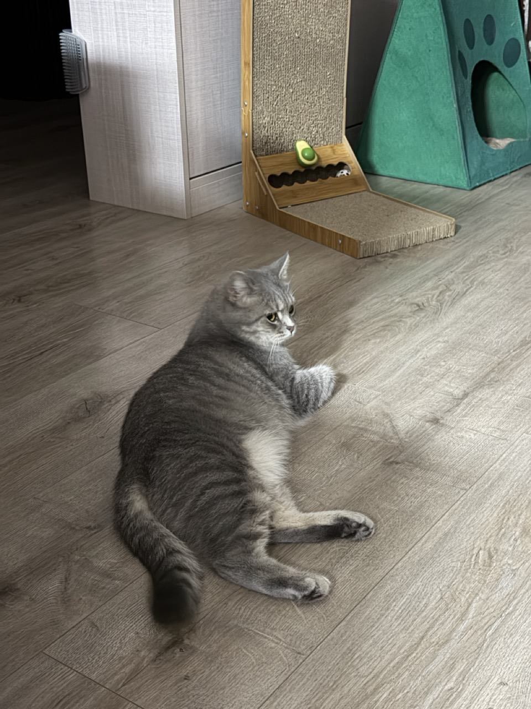
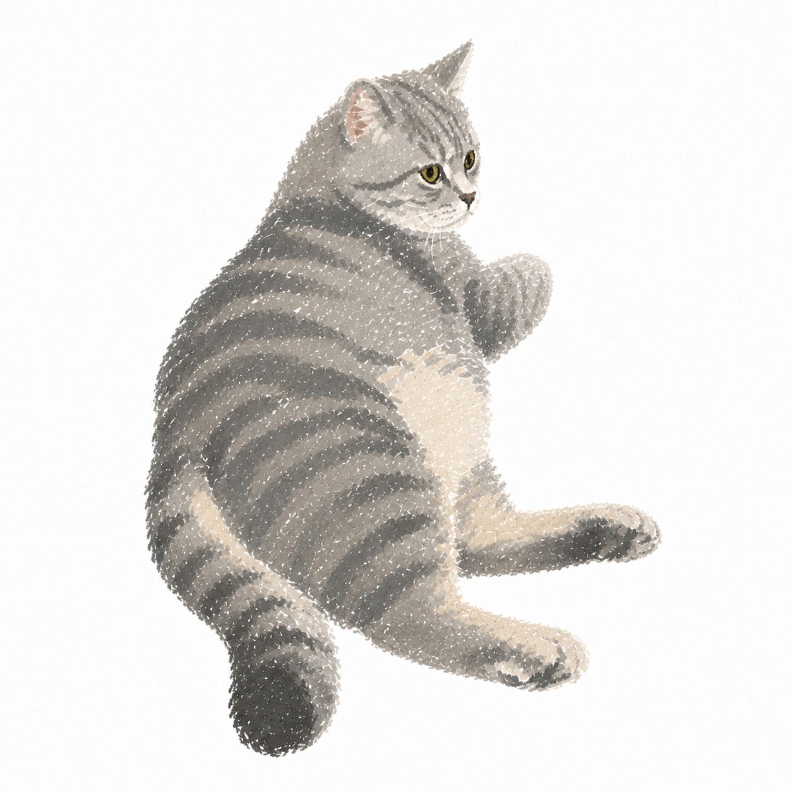
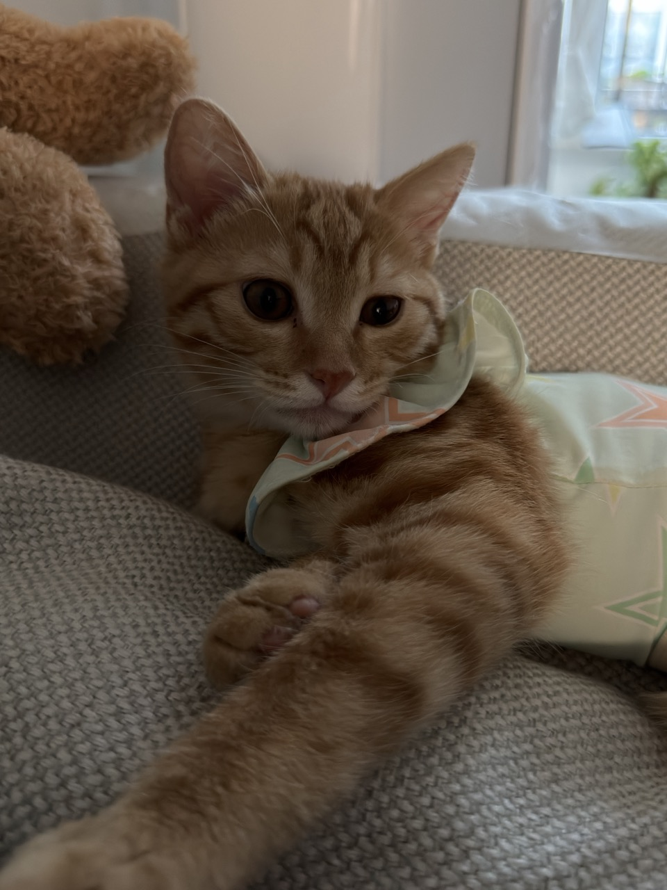
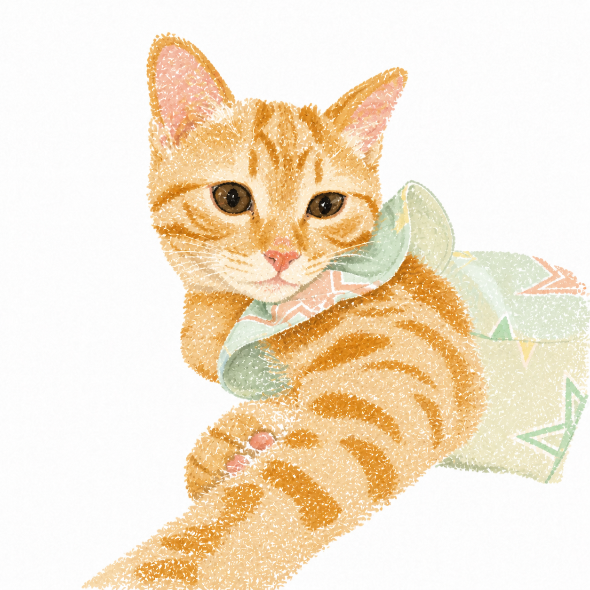
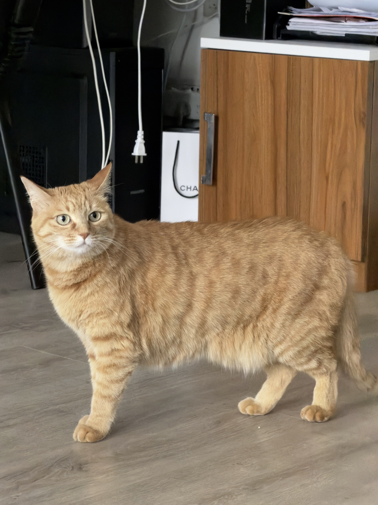
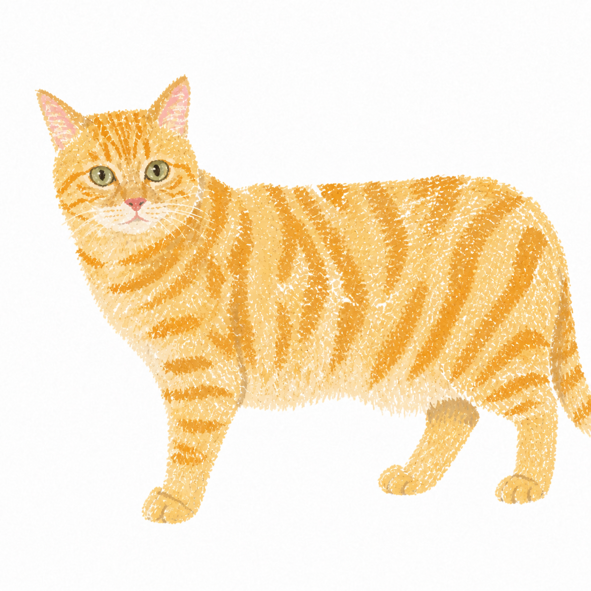

# cat-crayon-handdrawn-i2i

`cat-crayon-handdrawn-i2i` is a Codex image-transformation skill that converts real cat photographs into square, low-realism, hand-drawn crayon illustrations on white paper. It is designed to preserve the specific cat's visible silhouette, pose, orientation, proportions, markings, clothing, accessories, occlusion, and anatomical ambiguity.<br>

`cat-crayon-handdrawn-i2i` 是一个用于 Codex 的图像转换 Skill。它把真实猫咪照片转换为方形、低写实、白底的蜡笔手绘插画，同时尽量忠实保留特定猫咪在原照片中可见的轮廓、姿势、朝向、比例、花纹、衣服、配饰、遮挡关系与解剖歧义。


## ✨ Features | 功能特性 
- **Hand-drawn Style**: Transforms real cat photographs into naive, flat crayon illustrations with visible white-paper texture.<br>
  **手绘风格**：将真实猫咪照片转换为稚拙、平面、留有纸白的蜡笔手绘风格。
  
- **Identity First**: Prioritizes the specific cat’s visual identity by preserving clearly visible tabby markings, color regions, and other distinctive features.<br>
  **主体保真**：优先还原这只特定猫咪的视觉记忆，保留清晰可见的虎斑、色块和其他身份特征。
  
- **Pose Locked**: Strictly preserve the original cat posture, orientation, and silhouette without re‑posing or anatomical completion.<br>
  **姿态锁定**：严格保留猫咪原始姿态、朝向与外轮廓，不重新摆姿势，不补全解剖结构。
  
- **No Hallucination**: Keeps hidden or occluded body parts hidden and never invents paws, legs, tails, markings, or other uncertain anatomy.<br>
  **禁止幻觉补全**：被遮挡、不可见的身体部位保持隐藏，不凭空生成爪子、四肢、尾巴或新增花纹。不补画被遮挡或无法确认的腿、爪、尾巴及其他身体部位。


## 🖼️ Examples | 效果示例
The following examples show how the skill transforms real cat photographs into hand-drawn crayon illustrations while preserving each cat’s visible identity, pose, proportions, markings, and occlusion relationships.<br>
以下示例展示了本技能如何将真实猫咪照片转换为蜡笔手绘插画，同时保留猫咪可见的外形特征、姿势、比例、花纹及遮挡关系。

### Example 1 | 示例一
| Input Photo | Output Illustration |
|:---:|:---:|
| 输入照片 | 输出结果 |
|  |  |

### Example 2 | 示例二
| Input Photo | Output Illustration |
|:---:|:---:|
| 输入照片 | 输出结果 |
|  |  |

### Example 3 | 示例三
| Input Photo | Output Illustration |
|:---:|:---:|
| 输入照片 | 输出结果 |
|  |  |


## ✅ Requirements | 环境要求
- Codex with skill support.<br>
  支持 Skills 功能的 Codex 环境。

- Access to the built-in `imagegen` image-generation tool.<br>
  可以使用内置的 `imagegen` 图像生成工具。

- A cat photo in JPEG format is recommended, preferably under 1 MB in size.<br>
  推荐使用JPEG格式的猫咪照片，照片大小最好在1MB以内。

- The skill must be installed in the Codex skills directory.<br>
  本技能需要安装到 Codex 的 Skills 目录中。


## 📦 Installation | 安装
1. Clone or download this repository.<br>
   克隆或下载本仓库。

2. Copy the bundled `cat-crayon-handdrawn-i2i` folder into your Codex Skills directory:<br>
   将仓库中的 `cat-crayon-handdrawn-i2i` 文件夹复制到 Codex Skills 目录：

   ```bash
   cp -R cat-crayon-handdrawn-i2i ~/.codex/skills/
   ```

3. Restart Codex or start a new task so the installed skill can be rediscovered.<br>
   重启 Codex 或启动新任务，以便重新发现已安装的技能。
   
This skill relies on the built-in Codex `imagegen` skill and image-generation tool.<br>
此 Skill 依赖 Codex 内置的 `imagegen` Skill 和图像生成工具。


## 📌 Usage | 使用说明
**Upload a cat photograph and use a request such as:**<br>
上传一张猫咪照片，然后使用类似请求：

```text
Use cat-crayon-handdrawn-i2i to process this photo.
用 cat-crayon-handdrawn-i2i 处理这张照片。
```

The skill uses its inputs in this priority order:<br>
Skill 按以下优先级使用输入：

1. User photograph: the only factual and identity source.<br>
   用户照片：唯一的猫咪身份与事实来源。

2. `fixed-stroke-reference.png`: primary and locked stroke/material authority.<br>
   `fixed-stroke-reference.png`：主要且锁定的笔触与材质参考。

3. `cat-style-reference.png`: secondary cat-contour and simplification reference.<br>
   `cat-style-reference.png`：次级猫咪轮廓与简化方式参考。

4. `style-reference.png`: supporting white-paper editorial illustration reference.<br>
   `style-reference.png`：辅助的白纸编辑插画语言参考。

No style reference may supply factual pose, anatomy, color, markings, expression, or composition for the target cat.<br>
任何风格参考都不会提供目标猫咪的姿势、解剖、颜色、花纹、表情或构图事实。


## 🙏 Inspiration and Attribution | 灵感来源与致谢
This skill was inspired by Beike, my dear friend in real life, while its visual style was inspired by a portrait image-to-image prompt shared by a RedNote creator. The cat-specific preservation rules, pose-lock strategy, anti-hallucination constraints, and detail-control workflow were developed specifically for this skill.<br>
本技能的创作灵感来源于我现实生活中的密友贝壳，视觉风格则受到一位小红书创作者分享的人像图生图提示词启发。针对猫咪特征保留、姿态锁定、避免肢体臆造及细节控制的工作流程，均为本技能专门设计。

- RedNote creator ID: `1550311333` 小红书作者ID
- [Original RedNote post](https://xhslink.com/m/2Rim6dZ7dCP) 小红书原帖
- [Repository maintainer](https://github.com/Vieeeeeee) 小红书作者GitHub


## 📜 License | 许可证
The skill instructions and metadata are licensed under the MIT License. See [LICENSE](../LICENSE) for details.<br>
本技能的说明文件与元数据采用 MIT 许可证发布，详情请参阅 [LICENSE](../LICENSE)。

Third-party reference images and materials are excluded from the MIT License unless otherwise stated.<br>
除非另有说明，第三方参考图片及素材不包含在 MIT 许可范围内。


## 🙋 Author | 作者说明
Personal open-source skill sharing for learning and communication only.<br>
个人开源技能分享，仅用于学习交流。
